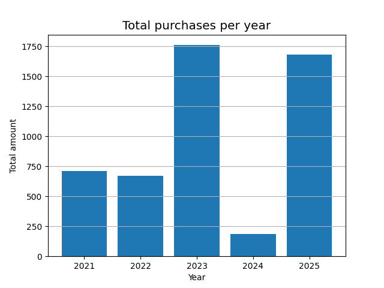

# Customer Purchase Analysis (Python + pandas)

This mini–project shows a full data‑handling pipeline:

1. **Import** a raw CSV file (`customers.csv`)
2. **Clean** missing values (`age`, `gender`)
3. **Feature engineer** a binned purchase level (`low / medium / high`)
4. **Aggregate** sales by country and registration year
5. **Visualise** yearly turnover with Matplotlib
6. **Export** the cleaned data set (`customers_cleaned.csv`)

## Project structure

```
├── .gitignore
├── customers_cleaned.csv           #generated
├── customers.csv
├── total_purchases_per_year.png    #generated
├── cleaner.py
├── requirements.txt
└── README.md
```

## Requirements

Make sure you have Python 3.7+ and the following Python packages:

```bash
pip install -r requirements.txt
```

## Getting Started

Clone the repository and run the analysis script:

```bash
python microsoft.py
```

## Sample Output

<p align="center">
  
</p>

## License

This project is licensed under the MIT License. Feel free to use and modify it as you like.